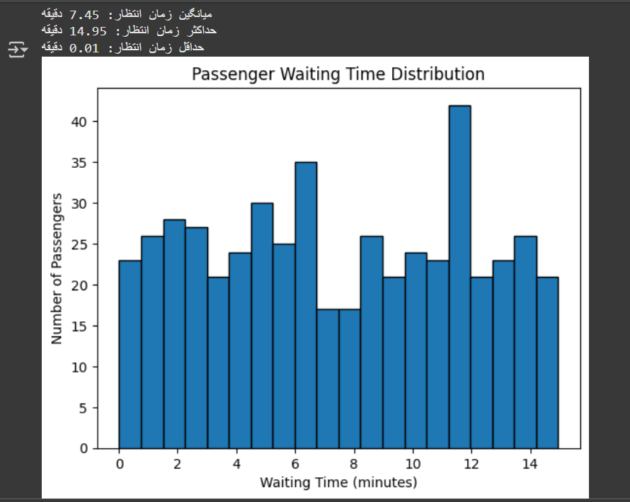

# Bus Station Waiting Time Simulation (Discrete Event Simulation)

## Project Overview

This project simulates a **bus station system** to analyze and evaluate the **average waiting time of passengers**.

The main goal is to study how passenger arrival patterns and fixed bus schedules affect queueing behavior and waiting time distribution.

## Methodology

The simulation is based on **Discrete Event Simulation (DES)**, where two independent stochastic processes are modeled:

### Passenger Arrival Process
- Passengers arrive at random intervals
- Inter-arrival time follows a **uniform distribution between 5 and 10 minutes**

### Bus Arrival Process
- Buses arrive at fixed intervals of **15 minutes**

## Simulation Settings

- Number of passengers: **500**
- Bus interval: **15 minutes**
- Passenger inter-arrival time: **Uniform(5, 10)**
- Bus capacity: **50 passengers (not fully utilized in this model)**

## What is Calculated?

For each passenger:

- Find the next available bus after arrival
- Compute waiting time:
\[
\text{Waiting Time} = \text{Bus Arrival Time} - \text{Passenger Arrival Time}
\]

Then compute:

- Average waiting time
- Maximum waiting time
- Minimum waiting time

## Output Analysis

### Average Waiting Time
~ **7.45 minutes**

This matches theoretical expectation:
\[
\frac{15}{2} = 7.5 \text{ minutes}
\]

### Maximum Waiting Time
~ **14.95 minutes**

Represents passengers arriving just after a bus departs.

### Minimum Waiting Time
~ **0.01 minutes**

Represents passengers arriving just before a bus arrives.

## Result Visualization
A histogram is generated to show the distribution of passenger waiting times.

It demonstrates that most passengers experience moderate waiting times centered around the expected theoretical mean.

## Concepts Used

- Discrete Event Simulation (DES)
- Queueing Systems
- Random Process Modeling
- Uniform Distribution
- Cumulative Sum Simulation
- Statistical Analysis
- Data Visualization (Histogram)

## Technologies

- Python
- NumPy
- Matplotlib

## Key Insight

The simulation confirms a fundamental result in queueing theory:

> When service is periodic and arrivals are uniform random, the expected waiting time is approximately half the service interval.

## 👩 Author

Fateme Khosravi
Computer Science Graduate | Interested in Data Science, Algorithms, and Systems Analysis
